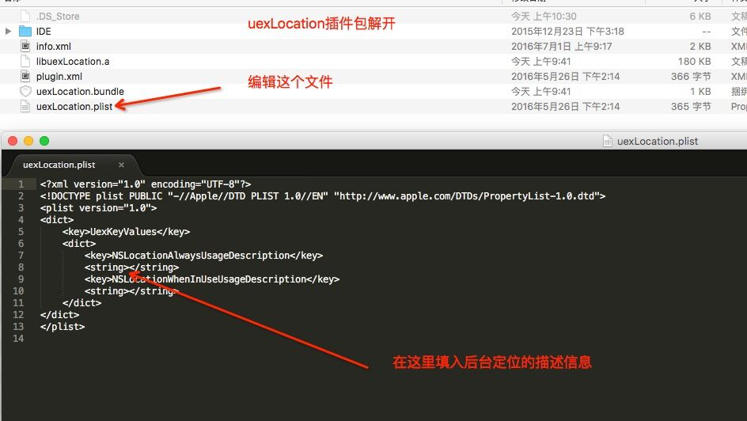

# FAQ-端开发

## 1. 使用uexBackground插件上传appstore被拒

### 具体问题描述：

> 使用uexBackground插件上传appstore被拒，官方回复拒绝的理由大概的意思是需要添加一个使用后台持续定位原因的描述，appcan的应用该如何添加这个描述？

### 回复：

>如下图，将uexLocation插件包解压，编辑uexlocation.plist文件，在下图红线箭头指向的标签内填入后台定位描述信息
>

