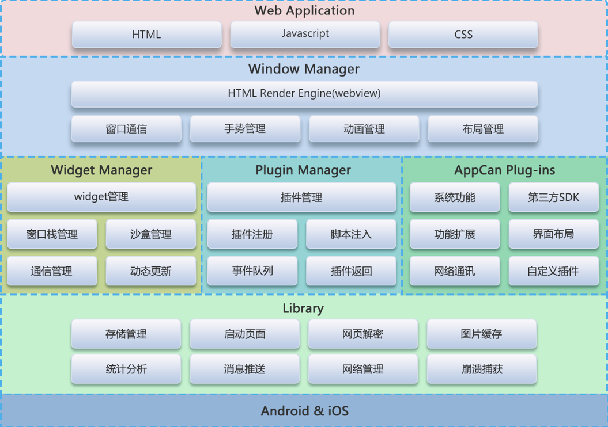

# AppCan引擎和插件技术

## 引擎架构及特性
### 架构



### 特性
* 引擎内核
  * 自主研发对浏览器内核进行封装，支持系统webview 和 crosswalk引擎
* 页面加载方式
  * 基于多窗口实现机制，采用多页面加载方式，即每个页面都由单独的webview来渲染。
* 应用管理
  * 一个HTML5应用称之widget，有唯一的应用ID、完整的生命周期、沙箱机制，通信机制。在引擎中，多个widget应用可以共存。
  * widget间通信机制
  	   * widget有栈来管理
  	   * widget之间通过包名、本地路径、widgetID等来进行相互调用
  	   * widget之间同步调用，通过参数和返回值来进行数据交换 	
  * widget生命周期管理
  		* 每个Widget都有独立的生命周期，如Start，Active，Suspend，Resume，Finish等，每个生命周期的状态都可以通过平台的On函数来通知Widget进行相应的处理。
* 应用热修复
	* App上线之后，BUG修复
	* 实现HTML/CSS/JS更新
	* 原生插件动态更新
 	
* 窗口管理
  * 引擎提供了三种类型的窗口
    * 普通窗口
      * 封装webview、页面弹动、上拉加载，下拉刷新，不可以改变窗口frame
    * 浮动窗口
      * 封装webview,可以改变窗口frame
    * 多页面浮动窗口
      * 封装多个webview,实现多个webview的平滑切换，可以改变窗口的frame
    * 弹出模态窗口(present window) 
    	* 弹出模态窗口主要使用于以下这几种情形：
    		* 1、收集用户输入信息
    		* 2、临时呈现一些内容
    		* 3、临时改变工作模式
    		* 4、显示一个新的window层级
    		* 这几种情形都会暂时中断程序正常的执行流程，主要作用是收集或者显示一些信息。
  * 每个widget应用中有一个窗口栈，窗口栈实现了窗口层级的管理
  	
  	
  * 窗口之间通信
    	* 窗口的唯一标识是窗口名称，通过PUB/SUB模式，来实现窗口之间的通信。
    	
  * 窗口特效
    	* 窗口动画
     	 * 支持多种窗口切换动画
    	* 侧边栏窗口
     	 * 封装webview，实现左右侧边栏特效。
    	* 手势滑动切换窗口
     	 * 通过手势向右滑动实现窗口的关闭特效。
* 多终端适配
	* CSS中em设置字体大小
	* 针对不同密度，映射em与像素值
	* 设置webview默认字体大小
	
* 插件原理
  * 通过iOS和Android提供注入JS代码到webview方式，实现JS与原生接口的相互调用。
* 解密机制
  * 针对加密的widget应用，应用唯一密钥，实现动态解密。
* 崩溃捕获
  * 应用崩溃之后，引擎能够捕获崩溃异常，记录崩溃日志。
  * 崩溃日志目录
* 消息推送
  * 集成消息推送机制，封装成JS对象，便于开发者直接在HTML页面中直接调用相关接口，处理推送消息
  * iOS
  * Android
* 启动图机制
  * 配置启动图片，能够适配多种分配率
  * 广告图


## 插件实现机制与开发

### 实现机制
* widget init
* window init
* plugin init
	* page render
		* page start 
		* page finish
		* dispatch queue + base script inject
		* page scrpit exec
		* webview hook
		* invoke native function
		* native callback
* 流程
 
		
		
### 插件基类EUExBase
* EUExBase是AppCan插件入口的基类，所有的插件入口类都必须继承自此类。
* 属性：弱引用webview实例
* init函数：插件入口
* clean函数：插件销毁
* 扩展方法：实现引擎与插件桥接

#### 插件开发
* 开发功能性插件
* 开发UI插件
	*  add view to window (固定位置)
	*  add view to webview 	（随webview内容滚动）
* 工程配置 （xcode & android studio）
* 插件命名
	* 插件的入口类**必须**命名为`EUEx`开头的类名：EUExDemoPlugin
	* 插件中其他的类**无命名限制，但建议增加独特的前缀**，以避免和引擎以及其他插件中的类产生类名冲突，导致打包失败
	
* 配置plugin.xml
	* 单例插件
	* 所有的回调都会进入root页面
	* 配置示例：

```xml
<?xml version="1.0" encoding="utf-8"?>
<uexplugins>
    <plugin
        className="org.zywx.wbpalmstar.widgetone.uexEasemob.EUExEasemob"
        uexName="uexEasemob"
        global="true">//与uexName同级
        <method name="login"/>
    </plugin>
</uexplugins>
```

* 编写代码
	* 编写入口类及plugin.xml配置的方法
	
	```objective-c
- (instancetype)initWithBrwView:(EBrowserView *)eInBrwView
{
    self = [super initWithBrwView:eInBrwView];
    if (self) {
        //NSLog(@"插件实例被创建");
    }
    return self;
}
- (void)clean{
    //NSLog(@"网页即将被销毁");
}
```
 
	* 拦截系统事件
		##### 拦截Application和Activity的生命周期

		引擎中封装了一些可拦截的生命周期方法，如下：
		
		iOS:
		
		```objective-c
			+ (BOOL)application:(UIApplication *)application didFinishLaunchingWithOptions:(NSDictionary *)launchOptions;
			+ (void)application:(UIApplication *)app didRegisterForRemoteNotificationsWithDeviceToken:(NSData *)deviceToken;
			+ (void)application:(UIApplication *)app didFailToRegisterForRemoteNotificationsWithError:(NSError *)err;
			+ (void)application:(UIApplication *)application didReceiveRemoteNotification:(NSDictionary *)userInfo;
			+ (void)application:(UIApplication *)application didReceiveRemoteNotification:(NSDictionary *)userInfo fetchCompletionHandler:(void (^)(UIBackgroundFetchResult))completionHandler
			+ (void)application:(UIApplication *)application didReceiveLocalNotification:(UILocalNotification *)notification;
			+ (BOOL)application:(UIApplication *)application handleOpenURL:(NSURL *)url;
			+ (BOOL)application:(UIApplication *)application openURL:(NSURL *)url sourceApplication:(NSString *)sourceApplication annotation:(id)annotation;
			+ (void)applicationWillResignActive:(UIApplication *)application;
			+ (void)applicationDidBecomeActive:(UIApplication *)application;
			+ (void)applicationDidEnterBackground:(UIApplication *)application;
			+ (void)applicationWillEnterForeground:(UIApplication *)application;
			+ (void)applicationWillTerminate:(UIApplication *)application;
			+ (void)applicationDidReceiveMemoryWarning:(UIApplication *)application;
			+ (void)application:(UIApplication *)application performActionForShortcutItem:(UIApplicationShortcutItem *)shortcutItem completionHandler:(void (^)(BOOL))completionHandler
	```
Android：

		```java
    		public static void onApplicationCreate(Context context)
    		public static void onActivityCreate(Context context)
    		public static void onActivityStart(Context context)
    		public static void onActivityReStart(Context context)
    		public static void onActivityResume(Context context)
    		public static void onActivityPause(Context context)
    		public static void onActivityStop(Context context)
    		public static void onActivityDestroy(Context context)
    ```
		
		示例:
	
		```objective-c
		//EUExDemoPlugin.m中
		
		static NSDictionary *AppLaunchOptions;
		
		+ (BOOL)application:(UIApplication *)application didFinishLaunchingWithOptions:(NSDictionary *)launchOptions{
		    NSLog(@"app launched");
		    //存储launchOptions
		    AppLaunchOptions = launchOptions;
		    return YES;
		}
		```

		```java
		    public static void onApplicationCreate(Context context) {
		        if (context instanceof WidgetOneApplication) {
		            WidgetOneApplication application = (WidgetOneApplication) context;
		        }
		    }
		    public static void onActivityCreate(Context context) {
		        if (context instanceof EBrowserActivity) {
		            EBrowserActivity activity = (EBrowserActivity) context;
		        }
		    }
```

		**注意不可在生命周期方法内做耗时的操作，否则会出现页面卡死的现象。**
	
* 运行调试
* 插件打包
	* 创建目录
	* 更新日志
	* iOS
	
	* Android
	
	


## 常用引擎插件功能介绍

* uexWidget
* uexWindow

* uexGestureUnlock手势锁
* uexBackgroud
* 启动图、广告图
* 代码调试
* 自定义引擎

## AppCan4.0引擎插件新技术

### JS接口同步返回对象，入参支持function传入
同步返回JsonObject，如：

```javascript
var data = {
   secret:"APP_SECRET",
   code:"CODE",
   grant_type:"authorization_code"
};
var result=uexWeiXin.getLoginAccessToken(data);
console.log("access_token: "+result.access_token);
console.log("expires_in: "+result.expires_in);
console.log("openid: "+result.openid);
/**
var result = {
    access_token: "ACCESS_TOKEN",
    expires_in: 7200,
    refresh_token: "REFRESH_TOKEN",
    openid: "OPENID",
    scope: "snsapi_userinfo",
    unionid:"UNIONID"
}
**/
```
支持多个`function`参数的传入：

```javascript
var params  = {       
};
uexWindow.test(params,function(){
	console.log("---------callback1--------");
},"params",function(){
	console.log("---------callback2--------");
});
```

### AppCan Widget SDK

Native app集成WidgetSDK, 实现HTML5应用与原生应用无缝对接，支持功能动态更新，无需下载App，缩短App迭代周期。

 

### AppCan引擎之Crosswalk

Crosswalk作为一款开源的web引擎，它的性能优于系统WebView。AppCan引擎集成Crosswalk，解决多Android版本WebView对HTML5功能支持不一致问题，使得HTML5应用具备较好的平台一致性和更好的用户体验。

### AppCan深度混合开发之uexPage

  深度混合开发模式：原生框架+HTML5渲染。使用uexPage作为App主框架，页面即可使用原生开发，也可以使用HTML5来开发。实现原生与HTML5深度混合。

 

##后续
* iOS-支持swift开发插件
* iOS-支持siri
* AppCan混合引擎与React Native融合
* .....