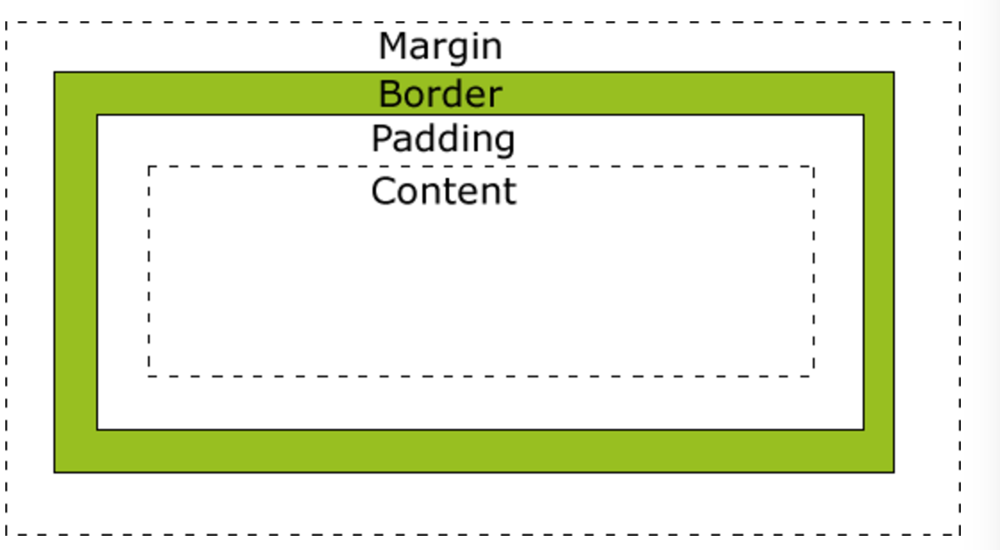

# uexNBListView构建原生布局-列表界面


## 简介

uexNBListView能够实现原生布局的列表界面。界面体验效果流畅、内存占用少。布局方式简单、灵活，开发者通过编写XML，实现自定义布局（类似CSS FlexBox模型）。

##盒子模型

布局元素可以看作盒子，用来设计和布局时使用。它包括：边距，边框，填充，和实际内容。

布局元素包括：

* relativelayout(相对布局)
* linearlayout(线性布局)
* text(文本控件)
* img(图片控件)
* button(按钮控件)

盒模型允许我们在其它元素和周围元素边框之间的空间放置元素。
下面的图片说明了盒子模型(Box Model)：


##弹性布局
* 相对布局
* 线性布局

##实现列表界面布局

###尺寸单位
* rpx（responsive pixel）: 可以根据屏幕宽度进行自适应。规定屏幕宽为750rpx。如在iPhone6上，屏幕宽度为375px，共有750个物理像素，则750rpx = 375px = 750物理像素，1rpx = 0.5px = 1物理像素。

###设计稿
* 设计师可以用iPhone6作为视觉稿的标准。屏幕宽度为750rpx，实现类似如下的列表风格：
  
  
###计算元素宽高和边距尺寸
* 在上图中搜素框的上边距为20rpx。计算出相对应的px.
* var topMargin = parseInt(20 * (window.screen.width/750));
* var topStr = new String(topMargin),转字符串
* topStr即是传入布局元素的px值

###编写xml布局

 其中margin的数据是根据设计稿，通过计算得到的。

```
<?xml version="1.0" encoding="utf-8"?>
<root layoutId = "1">
    <linearlayout width = "-1" height = "-2" background = '#FFFFFF'>
    	<relativelayout width = "-1" margin = "34 28 34 0" background = '#DDDDDD'>
    		<linearlayout id = 'li-1' width = '-2' height = '-2' float = 'center' orientation = "horizontal">
    			<button id = "button1" width = "-2" height = "-2" text="${title}"/>
            	<button id = "button2" width = "-2" height = "-2" text="搜索"/>
    		</linearlayout>
    	</relativelayout>

    	<linearlayout width = '-1' margin = "34 28 34 0" orientation = "horizontal">
    		<button id = "headerBtn" width = "-2" height = "-2" text="头像"/>
    		<linearlayout weight = '1' margin="28 0 0 0">
    			<text id = "txt" width = "-2" height = "-2" text = "性能俱乐部" textColor= "#000000" weight = '1'/>
    			<text id = "txt2" width = "-2" height = "-2" text = "1分钟前" textColor= "#000000" weight = '1'/>
    		</linearlayout>
    	</linearlayout>

    	<text id = "txt2Content" width = "-1" height = "-2" margin = "34 28 34 0" text = "南极三日游，线路美妙，大师带队寻找最美拍照机位，赶快报名参加吧~" textColor= "#000000"/>

    	<linearlayout width = '-1' margin = '34 28 34 0' orientation = 'horizontal' background = '#ff0000'>
            
            <linearlayout width = '14'>
            </linearlayout>
            
            <linearlayout width = '14'>
            </linearlayout>
            
        </linearlayout>


        <linearlayout width = '-1' height = '28' background = '#dddddd'>
        </linearlayout>


    </linearlayout> 
</root>
```

###编写html + js代码
* index.html应用入口
* homeList.js实现数据逻辑
* homeListItemLayout.xml实现页面逻辑

###注意
 * 关于XML布局中的layoutId和layoutType
 * layoutId指定当前布局的唯一标识符id，任何布局都必须定义该属性，否则视为无效。
 * layoutType用于开发者自定义布局id的关键字。
 * 如果布局中存在layoutType, 再调用setItem设置数据时，需要传入layoutType对应的关键字。如果不存在，则需要传入layoutId。以此来区分不同的数据、多种布局的实现。
 * 具体实现方式，请参考官方文档。

###调试运行
* IDE中导入uexNBListView插件
* 真机同步调试。

## 附录
### listview布局结构
  