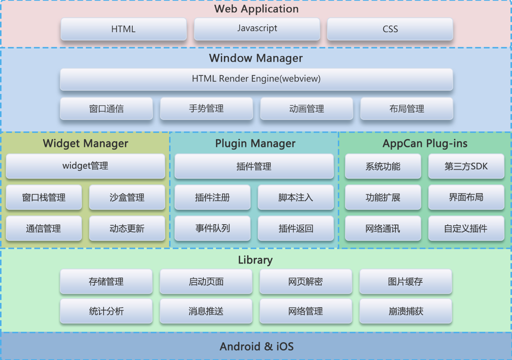
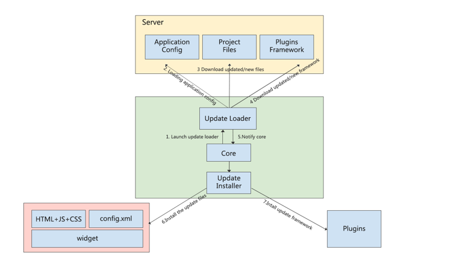
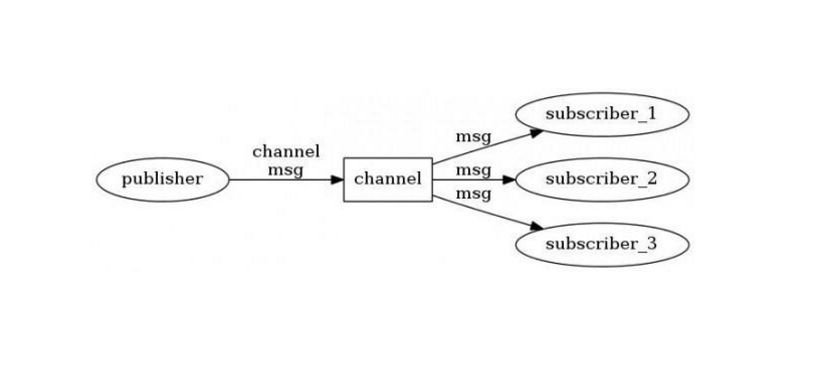
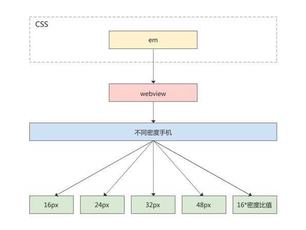

# App引擎概述

[TOC]

## 框架介绍

　　AppCan应用引擎是一个Hybrid App开发框架，具有跨平台、性能高、用户体验好，原生能力扩展性强等特点。能够实现Web App、Native App以及两者混合的Hybrid App的开发。底层框架通过对浏览器内核（WebView、Crosswalk, 腾讯X5等）的封装，实现了多页面渲染技术。同时，实现了标准原生能力扩展机制，便于开发者无限扩展。开发者可以通过标准的Web技术(HTML/CSS/JavaScript)开发移动应用，而原生接口以JS对象的方式呈现。

## 架构及特性

### 架构

　　AppCan Hybrid技术架构可以分为5个层级。最底层是移动操作平台，目前支持iOS和Android。之上是我们封装的各种通用组件库。比例说：统计分析、消息推送、网页解密、网络管理等等。第三层是我们的管理层，主要包括应用管理、插件的统一管理注册、以及相关的插件组件模块。第二层是window manager, 它负责网页面界面渲染和实现原生插件的调用。最上层是开发者使用HTML5来实现应用开发。 采用这样的架构，有很多技术优势：

1. 采用多窗口架构设计，与原生开发体系相吻合，实现与原生相媲美的效果。
2. 插件模块化架构设计，原生能力扩展性强。
3. 应用热修复能力，允许应用不需要重新编译的情况下，对网页功能模块和插件功能模块进行动态替换。这种方式，可以减少后期升级维护应用的复杂度。
4. 通过在引擎之上，我们结合用户在多终端的体验效果，完成一次开发，任何分辨率下的手机上，都可以保证最好的体验效果。
5. 同时，平台提供了丰富的基础插件，开发者可以简单快速使用这些组件，集成到自己的应用中。实现应用的快速迭代。

###特性

1. 引擎内核
  * 自主研发对浏览器内核进行封装，支持系统webview、crosswalk引擎和腾讯X5
2. 页面加载方式
  * 基于多窗口实现机制，采用多页面加载方式，即每个页面都由单独的webview来渲染。
3. 应用管理
  * WidgetOne应用管理器是整个widget的运行环境，功能主要包括widget管理、widget内部窗口管理、widget的生命周期管理、消息事件管理、widget间通信机制和widget的运行沙箱管理等。 
  * 一个HTML5应用称之widget，有唯一的应用ID、完整的生命周期、沙箱机制，通信机制。在引擎中，多个widget应用可以共存。
  * widget间通信机制
  	   * widget有栈来管理
  	   * widget之间通过包名、本地路径、widgetID等来进行相互调用
  	   * widget之间同步调用，通过参数和返回值来进行数据交换 	
  * widget生命周期管理
  		* 每个Widget都有独立的生命周期，如Start，Active，Suspend，Resume，Finish等，每个生命周期的状态都可以通过平台的On函数来通知Widget进行相应的处理。
4. 应用热修复
	* App上线之后，BUG修复
	* 实现HTML/CSS/JS更新
	* 原生插件动态更新
 	
4. 窗口管理
  * 每个widget应用中有一个窗口栈，窗口栈实现了窗口层级的管理 
  * 引擎提供了三种类型的窗口
    * 普通窗口
      * 封装webview、页面弹动、上拉加载，下拉刷新，不可以改变窗口frame
    * 浮动窗口
      * 封装webview,可以改变窗口frame
    * 多页面浮动窗口
      * 封装多个webview,实现多个webview的平滑切换，可以改变窗口的frame
    * 弹出模态窗口(present window) 
    	* 弹出模态窗口主要使用于以下这几种情形：
    		* 1、收集用户输入信息
    		* 2、临时呈现一些内容
    		* 3、临时改变工作模式
    		* 4、显示一个新的window层级
    		* 这几种情形都会暂时中断程序正常的执行流程，主要作用是收集或者显示一些信息。
  * 窗口之间通信
    	* 窗口的唯一标识是窗口名称，通过PUB/SUB模式，来实现窗口之间的通信。
    	
  * 窗口特效
    	* 窗口动画
     	 * 支持多种窗口切换动画
    	* 侧边栏窗口
     	 * 封装webview，实现左右侧边栏特效。
    	* 手势滑动切换窗口
     	 * 通过手势向右滑动实现窗口的关闭特效。

	
6. 多终端适配
	* CSS中em设置字体大小
	* 针对不同密度，映射em与像素值
	* 设置webview默认字体大小
	
	
7. 插件机制
  * 通过iOS和Android提供注入JS代码到webview方式，实现JS与原生接口的相互调用。
8. 解密机制
  * 针对加密的widget应用，应用唯一密钥，实现动态解密。
9. 崩溃捕获
  * 应用崩溃之后，引擎能够捕获崩溃异常，记录崩溃日志。
  * 崩溃日志目录
10. 消息推送
  * 集成消息推送机制，封装成JS对象，便于开发者直接在HTML页面中直接调用相关接口，处理推送消息
  * iOS
  * Android
11. 启动图机制
  * 配置启动图，能够适配多种分配率
  * 配置广告图，能够实现启动图消失之后需要显示的图片

## widget机制

　　通过AppCan平台生成的应用，可以理解为一个Widget包（即在IDE创建项目是看到的'phone'文件夹）和ppCan引擎框架组成的。通常的情况下，一个应用是由一个Widget+AppCan引擎框架构成。而'n个Widget+AppCan'是针对主widget以及普通widget的一种增强性的扩展机制，可以将具有特定功能的widget封装成一个单独的widget包存放到plugin目录下，然后通过js扩展接口调用，以达到功能扩展的目的。 

　　由于这部分资料在 [开发指导].开源&原生能力开发专题——《Widget插件扩展机制》部分均有详细介绍，在此不作赘述。

## 插件机制

　　AppCan引擎框架提供实现原生能力的机制，而这些实现原生功能的组件称之为插件。目前平台提供了丰富的插件资源，开发者可以根据自身业务需求来对开源插件进行扩展或自行开发。

　　源码在官网插件库均可下载，分为终端设备系统调用API、界面API、网络API、多媒体API、第三方API等几个类别，足够覆盖移动应用开发中的大部分常用场景。其中包含最新的支付宝插件、百度地图插件，备受关注的QQ登录功能插件、微信分享（支付）插件，以及推送、摄像头、传感器、LBS、二维码、文件读写、网络连接、上传下载、短信、彩信、电话、邮件、图片、其他第三方支付、音频、视频、压缩、原生控件元素等核心功能。

　　详细实现参考[开发指导].开源&原生能力开发专题——《Android插件扩展机制》和《iOS插件扩展机制》

## 自定义引擎

　　自定义引擎开发资料在 [开发指导].开源&原生能力开发专题——《自定义引擎机制说明》部分均有详细介绍，在此不作赘述

## 开源地址

　　iOS引擎托管地址： https://github.com/AppCanOpenSource/appcan-ios

　　Android引擎托管地址： https://github.com/AppCanOpenSource/appcan-android

## 开源协议

　　AppCan引擎插件开源遵循LGPL(GNU宽通用公共许可证)第三版： 英文版