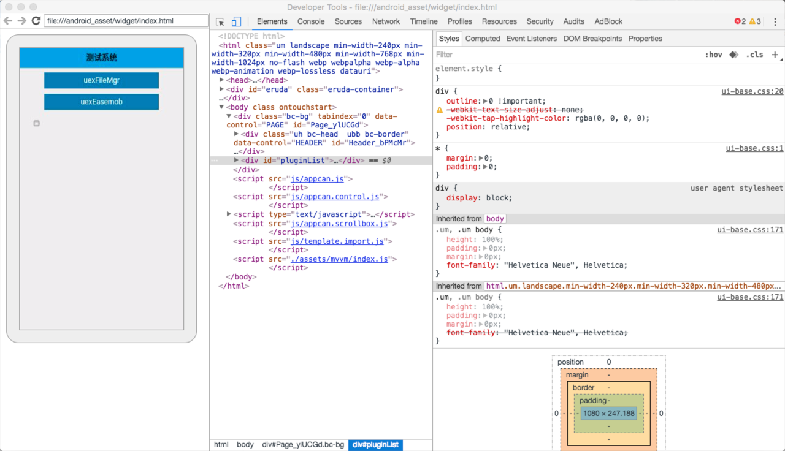

远程调试可以在Android设备上实时调试Android应用（在线打包的也可以），比本地打包同步调试。alert()、log之类的方便很多，可以快速定位问题。


# 需求

- Android 4.4+ 手机
- 电脑安装Chrome  Canary最新版本
- USB数据线连接电脑和手机
- 3.3以上Android引擎打包（最好使用最新引擎）
- 打包app时，config.xml中增加`<debug>true</debug>`

# 使用步骤

## 1.打开USB调试

在Android设备上，进入设置>开发者选项>勾选USB调试

 

> **注意**：在安卓 4.2 及以后的版本中，默认情况下开发者选项是隐藏的。要启用开发者选项，选择**设置**>**关于手机**然后点击版本号7次。不同型号的手机开启USB调试可能有些不同，请根据自己的型号自行搜索一下

## 2.通过USB连接设备

将手机和电脑用USB连接起来。（如果是windows下，需要安装对应的驱动）。

## 3.在Chrome中开始调试

手机端打开App（config.xml一定要配置`<debug>true</debug>`），

在电脑端的Chrome里，地址栏输入**chrome://inspect**

如果出现“No devices detected”，可能是驱动没有安装好或者需要重新连接一下手机

正常情况下可以看到正在运行的app所开启的页面了。如下图： 

需要调试哪个页面，点击"inspect"。接着电脑会加载新的Developer Tools 页面，如下图：

    

> 如果新的Developer Tools 出现空白或者一直处于loading状态，可能是网络问题，请参考[常见问题部分](常见问题)

接下来的调试方式就跟打开浏览器的开发者工具一样了。

## 4.定位开发中常见问题

### 判断插件有没有打进去，或者插件有没有某个接口

1. Dev Tools切换到“Sources”标签下，根据具体情况打上断点

   

2. 操作手机，让程序运行到断点的地方

3. 展开右侧边栏的“Scope”，点击Global

4. 滑动到最底部，查看有没有对应插件（插件一般以“uex”开头）。如下图，可以看到除了引擎的`uexWindow`等，只有环信插件`uexEasemob`

   

5. 接着点开`uexEasemob`,可以看到环信插件所有的接口。可以看到下图中比文档多了`registerCallback()`,因为这是4.0新加的接口，还没发布（调用了该接口的页面都可以收到回调）。 

### 判断插件传参是否有问题

1. Dev Tools切换到“Sources”标签下，在调用接口的地方打上断点

2. 让运行到断点地方，就可以很清楚的看到传给插件的值是多少，比alert或者console.log方便很多 

3. 在接口回调的地方打上断点，也可以很清楚的看到插件回调的数据到底是什么鬼

    （下图是环信的发送消息之后的回调，可以看到是一个JSON格式的字符串，String类型）

4. 继续用上面的断点。把顶部的tab切换到”console“

   输入：

   ```javascript
   console.dir(JSON.parse(data))
   ```

   可以看到data被转换成JSON对象之后的所有变量（官网文档中心挂了也不怕了...）

   

### 其他Chrome中的调试技巧都可以用

# 常见问题

### 点击inspect之后白屏

可能是因为被墙，需要采用正确的上网姿势

免费代理：https://github.com/getlantern/forum

付费代理：https://shadowsocks.com/

# 说明（非常重要）

调试完毕打包发布版本时一定要将远程调试关闭，即删除config.xml中的`<debug>true<debug>`或者将`true`改为`false`。

否则任何人都可以调试你的程序。

