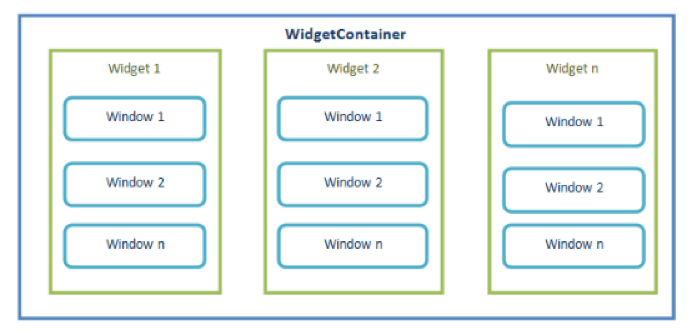
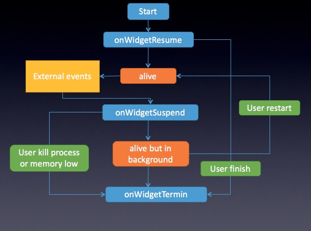

# uexWidget

### 简介

 一个HTML5应用称之widget，有唯一的应用ID、完整的生命周期、沙箱机制，通信机制。在引擎中，多个widget应用可以共存。

### widget间通信机制

*	widget有栈来管理
* 	widget之间通过包名、本地路径、widgetID等来进行相互调用 
*  widget之间同步调用，通过参数和返回值来进行数据交换


### widget生命周期管理

*  每个Widget都有独立的生命周期，	如Start，Active，Suspend，	Resume，Finish等，每个生命周	期的状态都可以通过平台的On函	数来通知Widget进行相应的处理。

	
### 示例

参考[ appcan-native-helper ](https://github.com/AppCanOpenSource/appcan-native-helper)